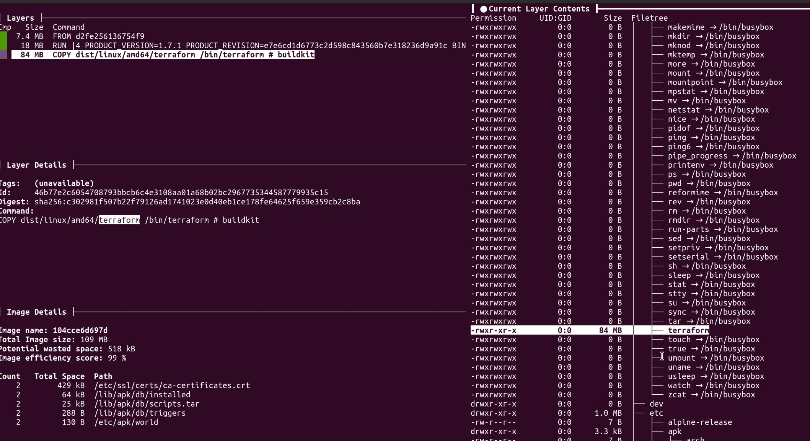

##Домашнее задание к занятию 5. «Практическое применение Docker»

#### Задача 1
        Сделайте в своем github пространстве fork репозитория https://github.com/netology-code/shvirtd-example-python/blob/main/README.md.
        Создайте файл с именем Dockerfile.python для сборки данного проекта. Используйте базовый образ python:3.9-slim. Протестируйте корректность сборки. Не забудьте dockerignore.
#### Задача* 2 пропущена 
#### Задача 3
    1 - Создайте файл compose.yaml. Опишите в нем следующие сервисы:
    

        WEB. Образ приложения должен ИЛИ собираться при запуске compose из файла Dockerfile.python ИЛИ скачиваться из yandex cloud container registry(из задание №2 со *). 
        Контейнер должен работать в bridge-сети с названием backend и иметь фиксированный ipv4-адрес 172.20.0.5. Сервис должен всегда перезапускаться в случае ошибок. 
        Передайте необходимые ENV-переменные для подключения к Mysql базе данных по сетевому имени сервиса web

        db. image=mysql:8. Контейнер должен работать в bridge-сети с названием backend и иметь фиксированный ipv4-адрес 172.20.0.10. Явно перезапуск сервиса в случае ошибок. 
        Передайте необходимые ENV-переменные для создания: пароля root пользователя, создания базы данных, пользователя и пароля для web-приложения. 
        Обязательно используйте .env file для назначения секретных ENV-переменных!

    2 - Запустите проект локально с помощью docker compose , добейтесь его стабильной работы.Протестируйте приложение с помощью команд 
    curl -L http://127.0.0.1:8080 и curl -L http://127.0.0.1:8090.

    3 - Подключитесь к БД mysql с помощью команды docker exec <имя_контейнера> mysql -uroot -p<пароль root-пользователя>.
    Введите последовательно команды (не забываем в конце символ ; ): show databases; use <имя вашей базы данных(по-умолчанию example)>; show tables; SELECT * from requests LIMIT 10;.

    4 - Остановите проект. В качестве ответа приложите скриншот sql-запроса.    

#### Задача 4
    
    1 - Запустите в Yandex Cloud ВМ (вам хватит 2 Гб Ram).
    2 - Подключитесь к Вм по ssh и установите docker.
    3 - Напишите bash-скрипт, который скачает ваш fork-репозиторий в каталог /opt и запустит проект целиком.    

        
    4 - Зайдите на сайт проверки http подключений, например(или аналогичный): https://check-host.net/check-http и запустите проверку вашего сервиса http://<внешний_IP-адрес_вашей_ВМ>:5000.

        
    5 - (Необязательная часть) Дополнительно настройте remote ssh context к вашему серверу. Отобразите список контекстов и результат удаленного выполнения docker ps -a
    6 - В качестве ответа повторите sql-запрос и приложите скриншот с данного сервера, bash-скрипт и ссылку на fork-репозиторий.

        sql-запрос

        bash-скрипт

[ссылка на fork-репозиторий](https://github.com/ub1984/shvirtd-example-python)

#### Задача* 5 пропущена 

    Напишите и задеплойте на вашу облачную ВМ bash скрипт, который произведет резервное копирование БД mysql в директорию "/opt/backup" с помощью запуска в сети "backend" контейнера из образа schnitzler/mysqldump при помощи docker run ... команды. Подсказка: "документация образа."
    Протестируйте ручной запуск
    Настройте выполнение скрипта раз в 1 минуту через cron, crontab или systemctl timer.
    Предоставьте скрипт, cron-task и скриншот с несколькими резервными копиями в "/opt/backup"

#### Задача 6 
    Скачайте docker образ hashicorp/terraform:latest и скопируйте бинарный файл /bin/terraform на свою локальную машину, используя dive и docker save. 
    Предоставьте скриншоты действий.

    используя dive

    docker save

    
#### Задача 6.1
    Добейтесь аналогичного результата, используя docker cp.
    Предоставьте скриншоты действий.

    docker cp

#### Задача* 6.2 пропущена
    Предложите способ извлечь файл из контейнера, используя только команду docker build и любой Dockerfile.
    Предоставьте скриншоты действий.

#### Задача* 7 пропущена

    Запустите ваше python-приложение с помощью runC, не используя docker или containerd.
    Предоставьте скриншоты действий.

Долго боролся с этой ошибкой

 решения  не нашел
